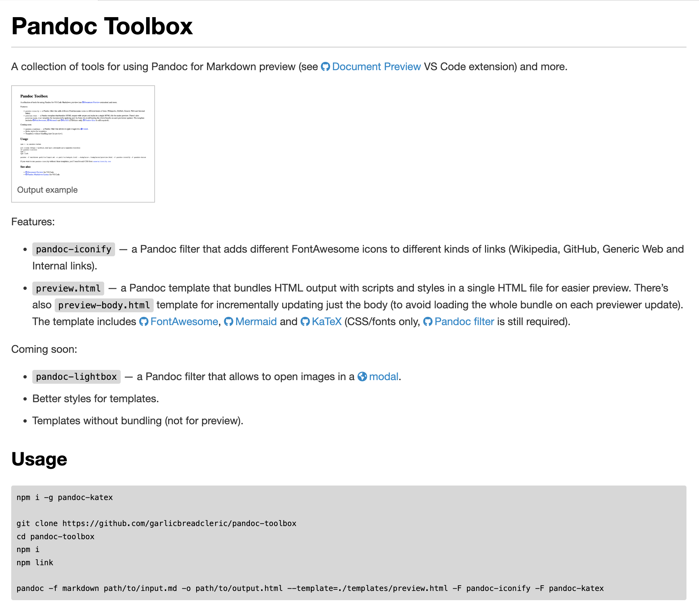

# Pandoc Toolbox

A collection of tools for using Pandoc for Markdown preview (see [Document Preview](https://github.com/garlicbreadcleric/vscode-document-preview) VS Code extension) and more.



Features:

- `pandoc-iconify` — a Pandoc filter that adds different FontAwesome icons to different kinds of links (Wikipedia, GitHub, Generic Web and Internal links).
- `preview.html` — a Pandoc template that bundles HTML output with scripts and styles in a single HTML file for easier preview. There's also `preview-body.html` template for incrementally updating just the body (to avoid loading the whole bundle on each previewer update). The template includes [FontAwesome](https://github.com/FortAwesome/Font-Awesome), [Mermaid](https://github.com/mermaid-js/mermaid) and [KaTeX](https://github.com/KaTeX/KaTeX) (CSS/fonts only, [Pandoc filter](https://github.com/xu-cheng/pandoc-katex) is still required).

Coming soon:

- `pandoc-lightbox` — a Pandoc filter that allows to open images in a [modal](https://www.w3schools.com/howto/howto_js_lightbox.asp).
- Better styles for templates.
- Templates without bundling (not for preview).

## Usage

```bash
npm i -g pandoc-katex

git clone https://github.com/garlicbreadcleric/pandoc-toolbox
cd pandoc-toolbox
npm i
npm link

pandoc -f markdown path/to/input.md -o path/to/output.html --template=./templates/preview.html -F pandoc-iconify -F pandoc-katex
```

If you want to use `pandoc-iconify` without these templates, you'll need to add CSS from [`assets/iconify.css`](./assets/iconify.css).

## See also

- [Document Preview](https://github.com/garlicbreadcleric/vscode-document-preview) for VS Code
- [Pandoc Markdown Syntax](https://github.com/garlicbreadcleric/vscode-pandoc-markdown) for VS Code
